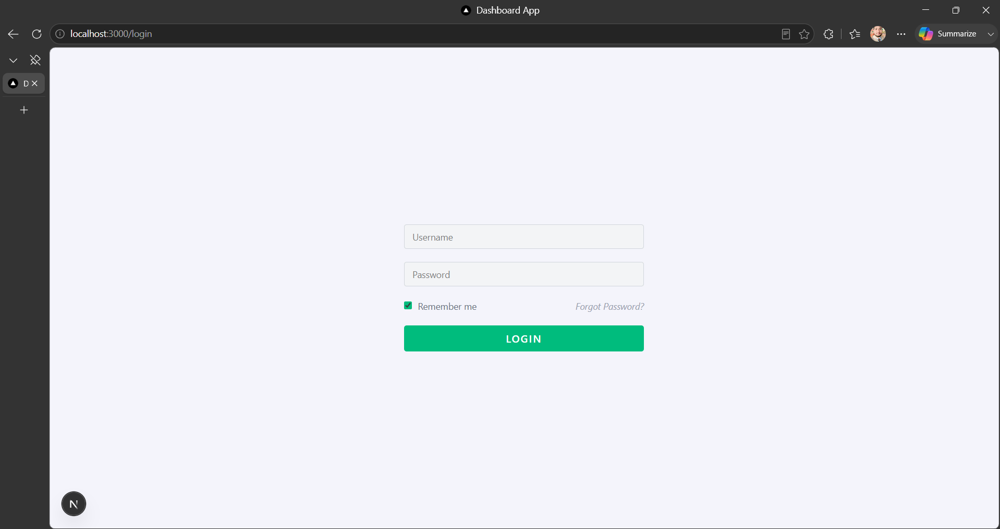
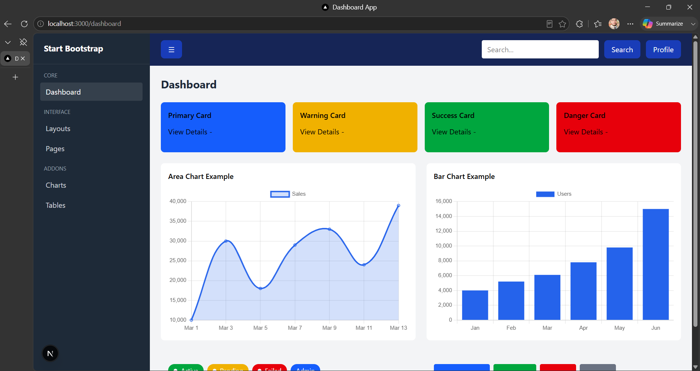
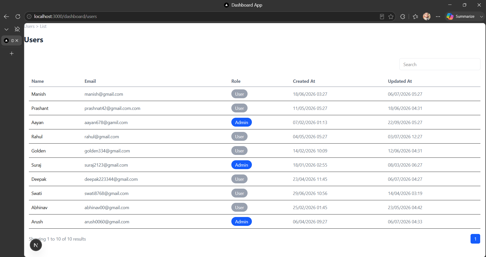
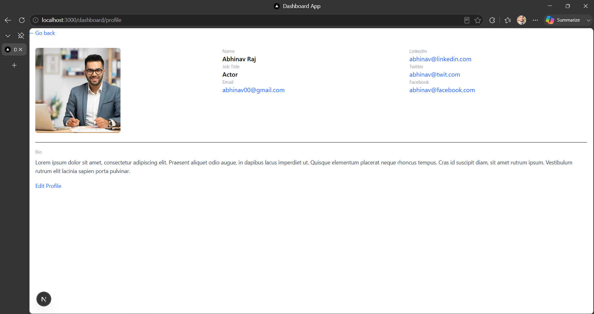

Capstone Mini Project

A fully responsive multi-page admin dashboard UI built with Next.js 14 (App Router) and Tailwind CSS — no backend, all data is dummy on the frontend.

## Screenshots

# Login Page


# Dashboard


# Users List


# Profile Page



## Components List

* Card :- Reusable container for stats, charts, and content blocks
* Badge :- Small status labels (Active, Pending, Failed, Admin) with optional dot indicator
* Button :- Reusable button with variant/color support (primary, outline, danger, etc.)
* Modal :- Popup dialog with header, body, and footer slots (used for "Add New Item")
* Input :- Styled form input with label supportSidebarLeft navigation menu (visible only on /dashboard)
* Navbar :- Top navigation bar with mobile menu toggleAreaChartLine/area chart widget for the dashboard
* BarChart :- Bar chart widget for the dashboard

## Lessons Learned

During the development of this project, I gained practical experience with several Next.js and React concepts:

* Learned how to use the Next.js App Router for creating nested routes and page-based navigation.
* Understood the importance of the Root Layout and why it must contain the <html> and <body> tags.
* Built reusable UI components such as Button, Card, Input, Badge, Modal, Sidebar, and Navbar to improve code reusability.
* Practiced React state management using useState for handling forms, modals, search functionality, and pagination.
* Implemented client-side search and pagination using mocked data without a backend.
* Improved my understanding of responsive UI design using Tailwind CSS.
* Learned to organize the project with a clean folder structure for better maintainability.
* Gained experience debugging common Next.js issues such as layout configuration and routing errors.
* Focused on writing simple, readable, and maintainable code that is easy to explain during code reviews.

## Project Structure

```text
capstone/
├── app/
│   ├── components/
│   │   └── ui/
│   │       ├── AreaChart.jsx
│   │       ├── Badge.jsx
│   │       ├── BarChart.jsx
│   │       ├── Button.jsx
│   │       ├── Card.jsx
│   │       ├── Input.jsx
│   │       ├── Modal.jsx
│   │       ├── Navbar.jsx
│   │       └── Sidebar.jsx
│   │
│   ├── dashboard/
│   │   ├── page.jsx
│   │   ├── profile/
│   │   │   └── page.jsx
│   │   └── users/
│   │       └── page.jsx
│   │
│   ├── lib/
│   │   └── dummydata.js
│   │
│   ├── login/
│   │   └── page.jsx
│   │
│   ├── favicon.ico
│   ├── globals.css
│   ├── layout.jsx
│   └── page.jsx
│
├── public/
├── screenshots/
│   ├── Dashboard.png
│   ├── login.png
│   ├── profile.png
│   └── Users.png
│
├── package.json
├── next.config.ts
└── README.md